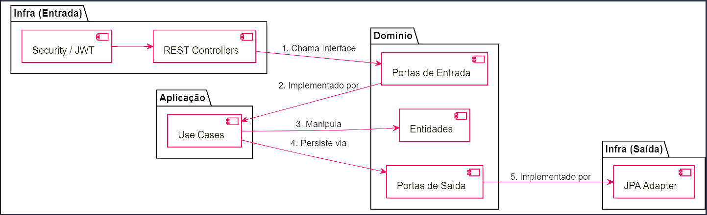

# API de Biblioteca em Kotlin - Minicurso Arquitetura Hexagonal

Este projeto foi desenvolvido como material de apoio para um **Minicurso de Kotlin**, com foco total em **Arquitetura Hexagonal (Ports & Adapters)**. O objetivo principal é demonstrar como construir aplicações robustas, desacopladas e alinhadas com as melhores práticas de mercado, garantindo facilidade de teste e manutenção.

## 🏗️ Conceito e Arquitetura

Diferente de arquiteturas tradicionais em camadas, a Arquitetura Hexagonal isola a lógica de negócio principal (o "core" da aplicação) de detalhes de infraestrutura (banco de dados, frameworks web, etc.).

### Fluxo de Comunicação
O fluxo de chamadas segue o princípio de que o **Domínio é o centro**, e a infraestrutura se adapta às portas definidas por ele. Veja o caminho que uma requisição percorre:


---

## 🛠️ Configuração de Ambiente

Para rodar este projeto, você precisará preparar o seu ambiente local:

1. **Java 17+** e **Kotlin** instalados.
2. **IDE:** Recomendamos o IntelliJ IDEA.
3. **Docker & Docker Compose:** Essencial para subir o banco de dados e as ferramentas de suporte.

### Variáveis de Ambiente
Neste projeto pessoal/didático, as variáveis de ambiente já estão configuradas diretamente no arquivo `docker-compose.yml`. 

> [!TIP]
> Para "devs novos", as variáveis foram mantidas no `docker-compose.yml` para facilitar a vida: basta baixar o projeto e rodar. Em ambientes produtivos, estas variáveis seriam setadas via **Secrets** ou **Environment Variables** do sistema.

As principais variáveis são:
- `SPRING_DATASOURCE_URL`: URL de conexão com o Postgres.
- `SPRING_DATASOURCE_USERNAME`: Usuário do banco (padrão: `postgres`).
- `SPRING_DATASOURCE_PASSWORD`: Senha do banco (padrão: `postgres`).

---

## 🚀 Como Executar

Você pode rodar a aplicação de duas formas principais:

### 1. Execução Local (Para Desenvolvimento)
Neste modo, você sobe apenas o banco de dados via Docker e roda a aplicação na sua máquina:

```bash
# Sobe o banco de dados e pgAdmin
docker-compose up -d postgres pgadmin

# Roda a aplicação via Gradle
./gradlew bootRun
```

### 2. Execução via Docker (Stack Completa)
Neste modo, a aplicação também é containerizada:

```bash
# Constrói o JAR
./gradlew build

# Sobe toda a aplicação
docker-compose up --build
```

A API estará disponível em `http://localhost:8080`.
O Swagger UI poderá ser acessado em: `http://localhost:8080/swagger-ui.html`

---

## 📜 Histórico de Commits (Aprendizado)

Este repositório foi construído utilizando **Commits Semânticos** granulares. Para entender a evolução do projeto e como cada peça da arquitetura foi encaixada, recomendamos que você explore o histórico do Git.

Cada commit representa um passo lógico na construção:
1. `chore`: Setup inicial do projeto e Gradle.
2. `feat`: Infraestrutura Docker e propriedades.
3. `feat(domain/model)`: Definição das entidades puras.
4. `feat(domain/repository)`: Portas de saída (interfaces).
5. `feat(domain/service)`: Portas de entrada (interfaces).
6. `feat(application/usecase)`: Lógica de negócio (implementação).
7. `feat(infra/persistence)`: Repositórios JPA.
8. `feat(infra/persistence)`: Adaptadores de persistência.
9. `feat(presentation/dto)`: Objetos de transferência de dados.
10. `feat(presentation/mapper)`: Mapas de conversão (DTO <-> Domínio).
11. `feat(presentation/security)`: JWT e Filtros de segurança.
12. `feat(presentation/web)`: Controllers e Exceções.
13. `feat(infra/config)`: Configurações de segurança e Spring.
14. `feat`: Classe principal e bootstrap.

---

## 📚 Tecnologias Full Stack
- **Kotlin** & **Spring Boot 3.3**
- **Spring Data JPA** & **PostgreSQL**
- **Spring Security** & **JWT**
- **Swagger (OpenAPI)**
- **Docker & Docker Compose**
